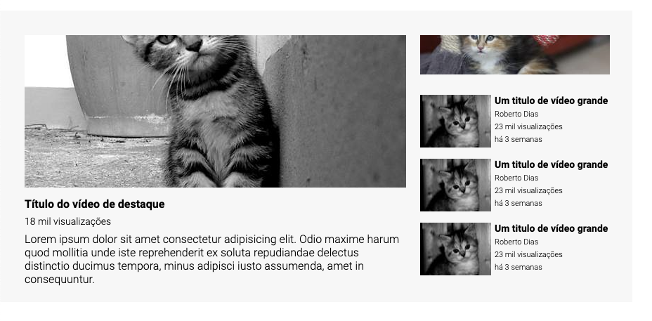

# Exercício Layout Utube
Exercício de HTML + CSS para criação de um layout similar ao do youtube

## Tecnologias utlizadas
- HTML
- CSS

## Dificuldades no projeto
- Uso do flexbox e grid
- Criar bons nomes para as classes